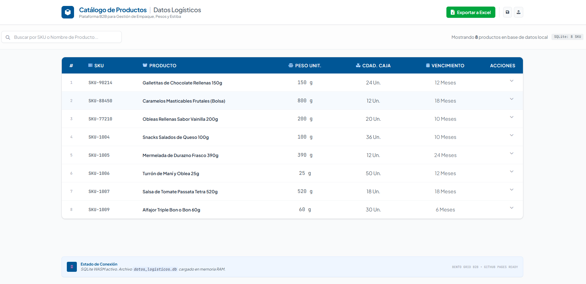
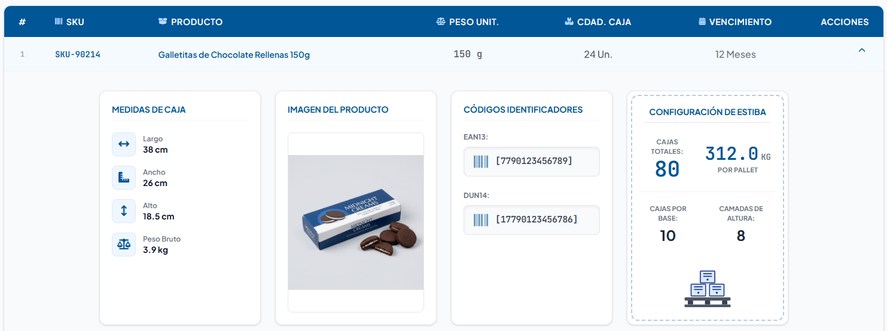

# 📦 Catálogo Logístico B2B

## 📋 Resumen del Proyecto
Una aplicación web ligera y minimalista diseñada para que empresas proveedoras (alimentos, snacks o retail) puedan conectar su base de datos local y visualizar al instante su catálogo de productos de forma elegante.

La tabla permite expandir cada fila para mostrar los datos agrupados de la siguiente forma:
- **Datos Maestros:** SKU, Nombre, Peso por Unidad, Cantidad por Caja y Vencimiento.
- **Datos de Empaque:** Dimensiones de la caja (Largo, Ancho, Alto), códigos EAN-13 y DUN-14, y Peso por Caja automático.
- **Datos de Estiba:** Cajas por base de pallet, altura en pallets y Cantidad Total de Cajas por Pallet.

## 📸 Capturas de Pantalla

*Vista principal de la tabla maestra.*

*Detalle expandido con información de empaque y estiba.*

## 🛠️ Tecnologías que Utilizamos
- **Frontend:** HTML5, Vanilla JavaScript, Tailwind CSS (estilo minimalista) y FontAwesome.
- **Base de Datos Cliente (In-Browser):** SQLite WASM (sql.js).
- **Exportación:** SheetJS para la descarga de archivos Excel en local.
- **Hosting y Build:** Vite y GitHub Pages.
- **Prototipado e IA:** Google AI Studio (Build Mode) y Google Antigravity 2.0.

## 🚀 Instalación y Uso Local
Si quieres correr el proyecto localmente:
1. `git clone https://github.com/Luciano-Veras/datos-logisticos.git`
2. `npm install`
3. `npm run dev`

## 🌐 Proyecto en Vivo
Puedes ver la aplicación funcionando aquí: **[Datos Logísticos en GitHub Pages](https://Luciano-Veras.github.io/datos-logisticos/)**
